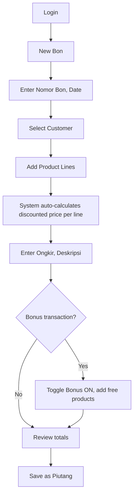
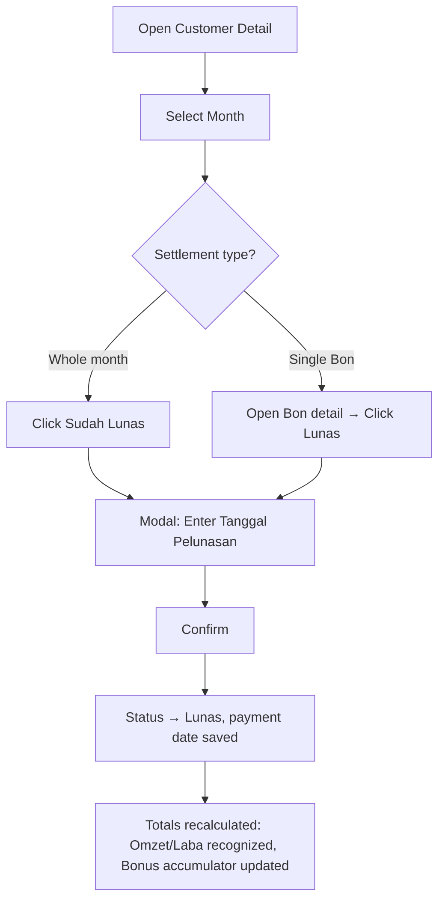
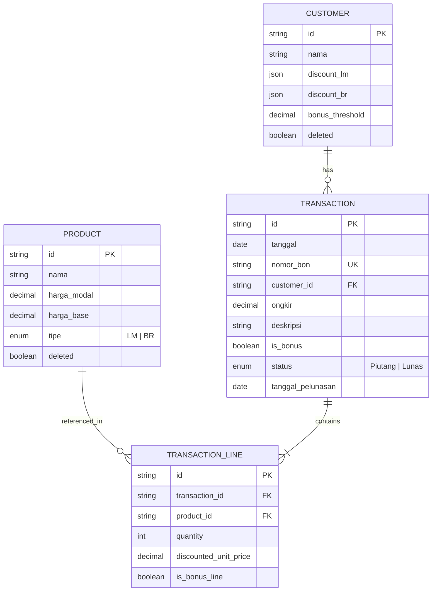

# Product Requirements Document (PRD)
## HL Sales & Receivables Management App

| Field | Value |
|-------|-------|
| **Version** | 1.0 |
| **Status** | Draft |
| **Date** | 8 June 2026 |
| **Source** | Acceptance Criteria — HL Sales & Receivables Management App |
| **Currency** | IDR (Rp) only — no tax/PPN |
| **Accounting basis** | Cash basis |

---

## 1. Executive Summary

HL Sales & Receivables Management App is a single-user internal web application for business **"HL"** to manage the full sales lifecycle: customers, products, transactions (Bon), receivables (Piutang), customer bonuses, and financial reporting.

The app replaces manual or spreadsheet-based tracking with a centralized system that enforces consistent pricing (cascading discounts), cash-basis revenue recognition, and automated bonus eligibility — reducing errors and giving HL real-time visibility into omzet, profit, and outstanding receivables.

---

## 2. Problem Statement

HL currently manages sales, discounts, receivables, and customer bonuses through processes that are prone to:

- **Inconsistent discount calculation** — cascading discounts applied incorrectly (summed instead of multiplied)
- **Delayed revenue recognition** — difficulty tracking which transactions are paid vs. outstanding
- **Manual bonus tracking** — no automated way to know when a customer has earned a bonus
- **Fragmented reporting** — omzet, laba, and piutang scattered across records with no single source of truth

---

## 3. Goals & Objectives

### 3.1 Primary Goals

| # | Goal | Success Indicator |
|---|------|-------------------|
| G1 | Accurate transaction & pricing management | All discounts computed via cascading formula; zero duplicate Nomor Bon |
| G2 | Real-time receivables visibility | Piutang totals always reflect current outstanding amounts |
| G3 | Automated bonus eligibility | System surfaces available bonuses based on paid omzet |
| G4 | Reliable financial reporting | Recaps match master calculation formulas; exportable as PDF |

### 3.2 Non-Goals (Out of Scope)

- Multi-user / role-based access control
- Self-registration or user management
- Tax / PPN calculation
- Multi-currency support
- Inventory / stock management
- Integration with external accounting or ERP systems
- Mobile-native app (responsive web is sufficient unless specified later)

---

## 4. Users & Personas

### 4.1 Primary User — HL Operator (Single User)

| Attribute | Detail |
|-----------|--------|
| **Role** | Owner / admin who manages all sales, customers, and reporting |
| **Technical level** | Comfortable with web apps; prefers simple, fast workflows |
| **Key tasks** | Create Bon, manage customers/products, settle piutang, check recap, grant bonuses |
| **Pain points** | Manual discount math, tracking who owes what, knowing when bonuses are due |

> **Note:** The app supports exactly **one user account**. There is no self-registration flow.

---

## 5. Glossary

| Term | Definition |
|------|------------|
| **Bon** | A single transaction / invoice, identified by Nomor Bon |
| **LM / BR** | Product types; each customer has separate discount sets per type |
| **Harga Modal** | Product cost price (what HL pays); used for profit only, never customer-facing |
| **Harga Base / Harga Jual** | Product list price before discount |
| **Diskon bertingkat (cascading)** | Sequence of % discounts applied one after another, NOT summed |
| **Ongkir** | Shipping cost; pass-through — charged to customer, no profit impact |
| **Omzet** | Revenue = discounted price × qty (shipping excluded); recognized when Lunas |
| **Laba HL** | Profit = (discounted price − modal) × qty; recognized when Lunas |
| **Piutang** | Receivable / unpaid amount; default status of a new transaction |
| **Lunas** | Paid / settled |
| **jt** | Juta = 1,000,000 |

---

## 6. Functional Requirements

### 6.1 Authentication

| ID | Requirement | Priority |
|----|-------------|----------|
| FR-1.1 | App requires login before any feature is accessible | P0 |
| FR-1.2 | Exactly one user account exists; no self-registration | P0 |
| FR-1.3 | Valid credentials → user lands on home/dashboard | P0 |
| FR-1.4 | Invalid credentials → clear error, no access granted | P0 |
| FR-1.5 | Session persists until logout (or expiry); logout option available | P0 |

---

### 6.2 Customer Management (CRUD)

A **Customer** has: Nama, Diskon per tipe (LM & BR), and a Bonus eligibility threshold.

| ID | Requirement | Priority |
|----|-------------|----------|
| FR-2.1 | Create customer with name (required) | P0 |
| FR-2.2 | Edit any field of existing customer | P0 |
| FR-2.3 | Delete performs soft-delete: hidden from new selections; historical transactions preserved | P0 |
| FR-2.4 | Two independent discount sets per customer: one for LM, one for BR | P0 |
| FR-2.5 | Discount set = ordered list of percentage values (e.g. LM = [20, 20, 10]); order matters | P0 |
| FR-2.6 | Within a discount set: add, edit, delete individual discount steps | P0 |
| FR-2.7 | Discount values numeric, 0–100; invalid entries rejected | P0 |
| FR-2.8 | Bonus eligibility threshold per customer (Rupiah amount, e.g. Rp 10,000,000) | P0 |

**Cascading discount rule (enforced everywhere):**

```
Given base price B and discount steps [d1, d2, … dn] (in %):
discounted unit price = B × (1 − d1/100) × (1 − d2/100) × … × (1 − dn/100)
```

| ID | Requirement | Priority |
|----|-------------|----------|
| FR-2.9 | Example validation: B=100, LM [20,20,10] → 57.6 (42.4% effective, NOT 50%) | P0 |

---

### 6.3 Product Management (CRUD)

A **Product** has: Nama, Harga Modal, Harga Base/Jual, Tipe (LM or BR).

| ID | Requirement | Priority |
|----|-------------|----------|
| FR-3.1 | Create, edit, delete products | P0 |
| FR-3.2 | Tipe restricted to LM or BR | P0 |
| FR-3.3 | Harga Modal and Harga Base numeric and ≥ 0 | P0 |
| FR-3.4 | Harga Modal used only for Laba; never shown as customer-facing price | P0 |
| FR-3.5 | Delete performs soft-delete: hidden from new selections; history preserved | P0 |

---

### 6.4 Transaction (Bon) Management

Each transaction captures:

| Field | Description |
|-------|-------------|
| Tanggal | Defaults to today; editable |
| Nomor Bon | Receipt number; must be unique |
| Customer | Selected from existing customers |
| Produk line items | Product, quantity; type & discounted price shown per line |
| Ongkir | Shipping amount |
| Deskripsi | Free text |
| Bonus | On/off toggle |
| Status | Piutang / Lunas; defaults to Piutang |

| ID | Requirement | Priority |
|----|-------------|----------|
| FR-4.1 | Date pre-filled with current date; editable | P0 |
| FR-4.2 | Nomor Bon required and unique; duplicate rejected with clear error | P0 |
| FR-4.3 | Customer selected from list (not free text) | P0 |
| FR-4.4 | Products selected from catalog (not free text) | P0 |
| FR-4.5 | Multiple product lines per transaction; quantity ≥ 1 per line | P0 |
| FR-4.6 | Each line shows product type (LM/BR) and discounted unit price for selected customer | P0 |
| FR-4.7 | Discount derived automatically from customer × product type; user does not enter manually | P0 |
| FR-4.8 | Ongkir numeric, ≥ 0, per transaction (not per line) | P0 |
| FR-4.9 | Status defaults to Piutang; user may set Lunas later | P0 |
| FR-4.10 | View, edit, delete transaction | P0 |
| FR-4.10.1 | Editing recalculates omzet, profit, and totals | P0 |
| FR-4.11 | Show computed values: per-line omzet, transaction omzet (excl. ongkir), ongkir, total owed | P0 |

**Calculation rules (per transaction):**

| Calculation | Formula |
|-------------|---------|
| Line discounted unit price | Cascading discount using customer's set for line's type |
| Line omzet | discounted unit price × quantity |
| Transaction omzet | Σ line omzet (ongkir excluded) |
| Amount owed (Piutang) | transaction omzet + ongkir |
| Line Laba HL | (discounted unit price − harga modal) × quantity |
| Ongkir | Pass-through → does not affect Laba HL |
| Recognition | Omzet and Laba recognized only when status = Lunas |

---

### 6.5 Bonus Logic

A **bonus bon** is a transaction opened to give a customer free bonus products once earned through accumulated paid omzet.

| ID | Requirement | Priority |
|----|-------------|----------|
| FR-5.1 | Each customer has bonus eligibility threshold (see FR-2.8) | P0 |
| FR-5.2 | Running accumulated omzet per customer; only Lunas transactions counted | P0 |
| FR-5.3 | Bonuses stack: available = floor(accumulated paid omzet / threshold) − bonuses already granted | P0 |
| FR-5.4 | When ≥1 bonus earned: surface eligibility flag/notification with count available | P0 |
| FR-5.5 | Bonus recorded as transaction with Bonus = on; multiple bonuses allowed in one bon | P0 |
| FR-5.6 | Each bonus granted consumes one threshold's worth of omzet; remainder carries over | P0 |
| FR-5.7 | Bonus product lines free: excluded from omzet; cost does not reduce Laba HL | P0 |
| FR-5.8 | Bonus transactions visually distinguishable; do not inflate revenue/receivables | P0 |

**Worked example:**

```
Given:  Customer A threshold = Rp 10,000,000
        Accumulated PAID omzet = Rp 25,000,000
        No bonuses granted yet

Then:   2 bonuses available (floor(25/10) = 2)

When:   User creates one bonus bon with both bonuses

Then:   Rp 20,000,000 consumed (2 × threshold)
        Rp 5,000,000 carries over
        Bonus products free → 0 omzet, 0 profit impact
```

---

### 6.6 Customer Detail Page

Each customer has a dedicated page showing activity grouped by month.

| ID | Requirement | Priority |
|----|-------------|----------|
| FR-6.1 | Transactions grouped by month (selectable month/year) | P0 |
| FR-6.2 | Per selected month, show: transaction list, Total Piutang, Total sudah dibayar, Total Omzet, Total Laba HL | P0 |
| FR-6.3 | Omzet shown with BR and LM in separate columns + combined total | P0 |
| FR-6.4 | View and download (PDF) Piutang list and transaction list | P0 |

**Settlement (Pelunasan) flows:**

| ID | Requirement | Priority |
|----|-------------|----------|
| FR-6.5 | **Settle whole month:** "Sudah Lunas" → modal for Tanggal Pelunasan → all transactions in month set to Lunas with payment date | P0 |
| FR-6.6 | **Settle single Bon:** "Lunas" on transaction detail → same payment-date modal → only that transaction settled | P0 |
| FR-6.7 | Settling updates totals immediately (Piutang ↓, sudah dibayar ↑, Omzet/Laba ↑, bonus accumulator ↑) | P0 |
| FR-6.8 | Already-Lunas transactions not re-settled; visually distinct | P0 |
| FR-6.9 | Clicking Bon opens full detail (lines, qty, prices, ongkir, omzet, status, payment date) | P0 |

---

### 6.7 Recap / Reporting

| ID | Requirement | Priority |
|----|-------------|----------|
| FR-7.1 | Recap per customer | P0 |
| FR-7.2 | Recap per product type (LM / BR) | P0 |
| FR-7.3 | Recap overall (all customers combined) | P0 |
| FR-7.4 | Filter/group by month and year | P0 |
| FR-7.5 | Minimum metrics: Total Omzet (Lunas), Total Laba HL (Lunas), Total Piutang, Total sudah dibayar — broken down LM vs BR | P0 |
| FR-7.6 | Overall recap shows total Laba HL across all customers | P0 |
| FR-7.7 | Bonus transactions excluded from omzet/revenue/profit; may appear separately as bonus log | P0 |
| FR-7.8 | Recaps downloadable as PDF | P0 |

---

## 7. Master Calculation Reference

Single source of truth for all calculations:

| Quantity | Formula |
|----------|---------|
| Discounted unit price | Base × Π(1 − dᵢ/100) over customer's discount steps for that type |
| Line omzet | discounted unit price × qty |
| Transaction omzet | Σ line omzet (ongkir excluded) |
| Amount owed (Piutang) | transaction omzet + ongkir |
| Line Laba HL | (discounted unit price − harga modal) × qty |
| Transaction Laba HL | Σ line Laba HL (ongkir excluded) |
| Recognized Omzet (reports) | Σ transaction omzet where status = Lunas |
| Recognized Laba HL (reports) | Σ transaction Laba HL where status = Lunas |
| Total paid | Σ (omzet + ongkir) where status = Lunas |
| Total outstanding piutang | Σ (omzet + ongkir) where status = Piutang |
| Bonus accumulator | Σ omzet where status = Lunas (per customer) |
| Bonuses available | floor(bonus accumulator / threshold) − bonuses already granted |
| Bonus items | free → 0 omzet, 0 profit impact |

---

## 8. User Flows

### 8.1 Create Sale (Bon)



### 8.2 Settle Receivable (Pelunasan)



### 8.3 Bonus Grant Flow

```mermaid
flowchart TD
    A[System tracks paid omzet per customer] --> B{floor omzet / threshold > bonuses granted?}
    B -->|No| C[No action]
    B -->|Yes| D[Show eligibility notification with count]
    D --> E[User creates Bonus Bon]
    E --> F[Add free bonus product lines]
    F --> G[Save → consumes threshold(s), remainder carries over]
```

---

## 9. Data Model (Conceptual)



---

## 10. Non-Functional Requirements

| ID | Category | Requirement |
|----|----------|-------------|
| NFR-1 | Performance | Page load & form submission < 2s on typical connection |
| NFR-2 | Data integrity | All monetary calculations use consistent rounding; no floating-point drift in totals |
| NFR-3 | Availability | Single-user internal app; standard uptime sufficient (no SLA required) |
| NFR-4 | Security | Credentials stored securely (hashed); session-based auth |
| NFR-5 | Usability | Discounts never manually entered on transactions — always auto-derived |
| NFR-6 | Auditability | Soft-deleted records preserved; transaction history immutable after creation (editable, not deleted from reports) |
| NFR-7 | Export | PDF generation for customer lists, piutang lists, and recaps |
| NFR-8 | Localization | UI in Indonesian; currency formatted as IDR (Rp) |

---

## 11. Confirmed Business Decisions

| # | Question | Decision |
|---|----------|----------|
| D1 | Ongkir & profit | Pass-through — shipping adds no profit. Laba = omzet − modal |
| D2 | Receivable vs omzet | Customer owes omzet + ongkir; omzet excludes ongkir |
| D3 | Omzet / eligibility basis | Only Lunas transactions count → cash basis |
| D4 | Bonus mechanics | Bonuses stack; multiple in one bon; each consumes one threshold, remainder carries |
| D5 | Bonus product cost | Ignored in profit — free bonus items do not reduce Laba HL |
| D6 | Deleting items with history | Soft-delete (hide from new use, keep history) |
| D7 | Nomor Bon | Must be unique; duplicates rejected |
| D8 | Export format | PDF |
| D9 | Currency / tax | IDR only, no tax/PPN |

---

## 12. Screen Inventory (Suggested)

| Screen | Description |
|--------|-------------|
| Login | Single credential form |
| Dashboard / Home | Summary KPIs: total piutang, omzet bulan ini, bonus pending |
| Customer List | CRUD list with search |
| Customer Form | Name, LM/BR discount steps, bonus threshold |
| Customer Detail | Monthly grouped transactions, settlement actions, PDF export |
| Product List | CRUD list |
| Product Form | Name, modal, base price, type |
| Transaction List | All Bon with filters (status, customer, date) |
| Transaction Form | Create/edit Bon with line items |
| Transaction Detail | Full Bon view with settle action |
| Recap — Customer | Per-customer financial summary |
| Recap — Product Type | LM vs BR breakdown |
| Recap — Overall | All-customers combined |
| Bonus Log | Optional separate view for bonus transactions |

---

## 13. Acceptance Criteria Mapping

This PRD is derived from acceptance criteria document `acceptance-criteria-HL-app.pdf`. All AC items (AC-1.1 through AC-7.8) map directly to functional requirements FR-1.1 through FR-7.8 in this document.

| AC Section | PRD Section |
|------------|-------------|
| §1 Authentication | §6.1 |
| §2 Customer Management | §6.2 |
| §3 Product Management | §6.3 |
| §4 Transaction Management | §6.4 |
| §5 Bonus Logic | §6.5 |
| §6 Customer Detail | §6.6 |
| §7 Recap / Reporting | §6.7 |
| §8 Master Calculation | §7 |
| §9 Confirmed Decisions | §11 |

---

## 14. Open Questions

All major business decisions have been resolved (D1–D9). Remaining implementation-level questions for engineering:

| # | Question | Owner | Status |
|---|----------|-------|--------|
| Q1 | Tech stack preference (web framework, database)? | Engineering | Open |
| Q2 | Session expiry duration? | Product | Open |
| Q3 | Rounding rule for IDR (nearest rupiah, no decimals)? | Product | Open |
| Q4 | Dashboard KPI specifics beyond piutang/omzet? | Product | Open |
| Q5 | Backup / data export strategy beyond PDF? | Engineering | Open |

---

## 15. Release Plan (Suggested Phases)

### Phase 1 — Core (MVP)
- Authentication
- Customer CRUD with cascading discounts
- Product CRUD
- Transaction (Bon) CRUD with auto-pricing
- Basic customer detail page

### Phase 2 — Financial Operations
- Pelunasan flows (monthly + single Bon)
- Cash-basis omzet/laba recognition
- Customer detail totals & PDF export

### Phase 3 — Bonus & Reporting
- Bonus eligibility tracking & grant flow
- Recap per customer, per type, overall
- PDF export for recaps

---

## 16. Success Metrics

| Metric | Target |
|--------|--------|
| Discount calculation accuracy | 100% match with master formula |
| Duplicate Nomor Bon prevention | 0 duplicates accepted |
| Report total accuracy | Recap totals = sum of underlying Lunas transactions |
| Bonus eligibility accuracy | Manual verification matches system for all test customers |
| Time to create a Bon | < 3 minutes for typical 5-line transaction |

---

*End of PRD*
